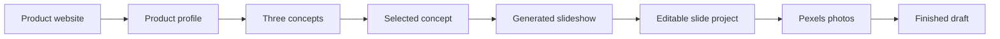

# Slides Auto workflow

This document explains the current slideshow workflow at a high level: how a
product becomes content ideas, how those ideas become a fixed number of slides,
how image searches are created, what can be edited, and exactly when external
APIs are called.

## End-to-end flow

The normal AI workflow is:

1. Paste a public product website URL.
2. Review the small product profile extracted from that page.
3. Choose a copy format, or let the app choose one.
4. Generate three different content concepts.
5. Select one concept, a slide count, and a text style.
6. Generate the complete slideshow.
7. Edit text, order, styles, themes, and images in the studio.
8. Search for one image at a time or automatically fill every missing image.

There is also a script workflow. A user can paste existing copy and have the
browser split it into slides without calling Claude. The resulting slides use
the same editor and image workflow as AI-generated slides.

## API calls by stage

| User action | App route | External service | Number of external API calls |
| --- | --- | --- | --- |
| Analyze a new product URL | `POST /api/products/profile` | Anthropic Messages API with Claude Web Fetch | One Claude request |
| Select an already saved product profile | None | None | Zero |
| Generate three concepts | `POST /api/generate` with `mode: "concepts"` | Anthropic Messages API | One Claude request |
| Generate a slideshow | `POST /api/generate` with `mode: "slideshow"` | Anthropic Messages API | One Claude request |
| Rewrite one slide | `POST /api/generate` with `mode: "slide"` | Anthropic Messages API | One Claude request per click |
| Compose slides from a pasted script | None | None | Zero |
| Search for a photo | `GET /api/images/search?query=...` | Pexels Search API | One Pexels request per search |
| Auto-fill missing photos | One `GET /api/images/search` per missing slide | Pexels Search API | One Pexels request per missing slide |
| Display a selected Pexels photo | None of our API routes | Pexels image CDN | Normal browser image request |
| Upload a local image | None | None | Zero |
| Edit text, change styles, reorder, duplicate, or remove slides | None | None | Zero |
| Save the current project | None | None | Zero; saved in browser storage |

The API keys remain server-side. The browser calls our Next.js routes, and
those routes add `ANTHROPIC_API_KEY` or `PEXELS_API_KEY` when contacting the
provider.

### What a typical full AI generation costs in calls

Starting from a new product URL and ending with generated copy takes three
Claude requests:

1. Extract the product profile.
2. Generate three concepts.
3. Generate the selected slideshow.

Reusing a saved product profile takes two Claude requests because the profile
does not need to be extracted again. Every optional slide rewrite adds one more
Claude request.

Images are separate from Claude. If a five-slide project has five missing
images, **Auto-fill missing images** makes five Pexels searches. It does not
call Claude again because the image queries were already generated with the
slide copy.

## Stage 1: product profile

The product URL gives the app enough context to infer a niche and useful
content territory without asking the user to enter a separate topic.

`POST /api/products/profile` sends the URL to Claude with Web Fetch enabled.
Claude reads the public page and returns only:

- Product name
- Niche
- One plain-language value proposition

The extraction prompt treats webpage content as untrusted and tells Claude to
ignore instructions found inside the page. It also prevents unsupported
features, numbers, and claims from being added.

The user reviews the profile before saving it. Profiles are stored in the
current browser, up to 20 profiles, and can be reused without fetching the
website again. The workflow assumes the user created and personally uses the
product, so later copy may speak from that point of view.

## Stage 2: three content concepts

Concept generation uses the product's niche and value proposition to create
three genuinely different directions. A concept contains:

- The opening hook
- The content angle
- How the product can appear naturally
- The copy format to use

The app does not require a separate topic field. Claude infers useful nearby
topics from the product profile, while keeping each concept useful even to a
viewer who never buys the product.

### Copy formats

The current formats are:

- **Personal Results List:** the speaker shares the specific actions that
  helped them get a result. The product can be one real part of that result.
- **Helpful Habits List:** most slides are standalone tips. One middle slide
  expands into a personal example where the product can make a brief cameo.
- **Smart pick:** Claude selects the stronger format for the context. Across
  the three concepts, it is instructed to use both available formats.

Formats control structure and product placement. They do not replace the main
voice rules.

## Prompting and copy rules

Copy generation combines four layers of context:

1. **System voice:** conversational first-person writing, short sentences, and
   roughly a seventh-grade reading level.
2. **Copy format:** the narrative structure and the role the product should
   play.
3. **Product profile:** the factual name, niche, and value proposition.
4. **Selected concept:** the exact hook, angle, and planned product placement.

The system prompt aims for writing that sounds like a supportive friend in a
group chat. It rejects motivational-poster language, influencer-style calls to
action, fabricated results, and repeated points. Words explicitly excluded by
the current prompt are `chaos`, `clarity`, `intentional`, `aligned`, `clutter`,
`hijacked`, and `reclaim`.

Generated hooks are limited to 120 characters and supporting copy to 180
characters. The product does not need to appear on every slide.

## Slideshow count and structured output

The user can request 2–10 slides. The generated response needs to match that
number exactly.

[Anthropic structured outputs](https://platform.claude.com/docs/en/build-with-claude/structured-outputs)
cannot enforce arbitrary array lengths greater than one. For that reason, the
API does not ask Claude for an unconstrained `slides` array. It dynamically
builds numbered required fields such as `slide1`, `slide2`, `slide3`, and so on
for the requested count.

Claude must fill every numbered field. The server then converts those fields
back into the normal ordered slide array and validates every slide before
returning it to the browser. This prevents a five-slide request from quietly
becoming four or six slides.

The numbered fields are only an API transport format; the copy is not
hardcoded. Claude writes the hook, body, and image query inside every field.
The normalizer also accepts the older array response shape for compatibility.
If Claude slightly exceeds a text limit, the server safely shortens that field
instead of throwing away the entire generated slideshow.

Each generated slide contains:

- Hook text
- Optional body text
- Image search query
- Text style ID

## Image-query logic

The current image-query experiment deliberately uses the same phrase for every
slide:

`girl aesthetic faceless wellness warm`

This query is set by the application rather than generated by AI. It applies to
new AI slides, pasted-script slides, rewritten slides, existing projects,
manual image search, and automatic image filling. The goal is to isolate how
consistent Pexels results are when every slide starts from the same broad visual
direction.

The longer-term image-query design below is temporarily disabled during this
test.

The planned longer-term design would generate an image query at the same time
as each slide so the model understands the copy, product niche, and overall
concept while choosing a visual direction. Selecting images would still happen
later without another AI call.

The product niche and the carousel's emotional mood are the visual anchor. An
image does not need to reenact the exact sentence on its slide. A sleep slide
about putting a phone away, for example, could use a woman meditating outdoors,
a quiet morning bedroom, or a calming evening ritual. The goal is a cohesive
visual world rather than a literal picture for every line.

Queries aim for three to seven concrete search terms that describe a photograph
rather than summarize an idea. The prompt asks for:

- A visible person or object
- An action or setting when useful
- A candid lifestyle-photo feeling
- Warm natural light with muted cream, beige, brown, or terracotta tones
- A balanced mix of faceless women, objects, rooms, nature, hands, shadows, and
  environmental details
- Women as the subject whenever a person appears, favoring cropped, back-view,
  silhouette, shadow, hands, or point-of-view framing
- Evocative scenes related to the wider niche instead of literal reenactments
- A scene that works in a portrait crop
- A different visual idea for each slide

It avoids product names and abstract ideas because stock-photo search works
better with scenes that could physically appear in a photograph. It also avoids
naming social or visual inspiration platforms. Male subjects are not requested.

For example:

- Weak: `better sleep healthy habits`
- Stronger: `woman charging phone across bedroom`

The stronger query gives Pexels a subject, an action, and a setting. It is more
likely to return a usable image instead of a generic wellness photo.

In the current experiment, pasted scripts and manually created slides use the
same fixed query. A future version can derive a fallback from the script or
project-level visual direction without requiring an AI call.

## Pexels image workflow

Opening **Search Pexels** uses the active slide's image query automatically.
The user can change the search phrase and run another search. The server asks
Pexels for up to 12 medium-sized portrait results.

Selecting a result stores the portrait image URL on the slide and immediately
uses it as the slide background. The provider, photographer, photographer page,
and Pexels photo page are retained as internal metadata, although the current
prototype does not display those credits in the editor.

**Auto-fill missing images** works as follows:

1. Find slides that do not already have an image.
2. Resolve an image query for each eligible slide.
3. Search Pexels once per slide, in parallel.
4. Prefer a result not already used elsewhere in the project.
5. Apply successful matches without replacing existing images.
6. Report how many slides were filled and how many could not be matched.

A user-uploaded PNG, JPEG, WebP, or GIF bypasses Pexels entirely. Uploads are
limited to 5 MB because the file is stored in browser storage as a data URL.

## Editing after generation

Generated slides become the same editable slide objects as manually created
slides. Nothing is locked after generation.

The current studio supports:

- Editing hook and supporting text
- Rewriting one slide with Claude while providing the previous and next hooks
- Switching the project theme
- Choosing a text style for one slide
- Applying one text style to every slide
- Adding, duplicating, deleting, and reordering slides
- Searching, replacing, uploading, and removing slide images
- Renaming the project

A single-slide rewrite sends Claude the current slide plus neighboring hooks so
the replacement keeps its place in the larger sequence. It preserves the
slide's identity and existing image, while updating the hook, body, image
query, and text style output.

### Text-layer model

Each slide stores text as layers rather than as one flattened caption. The
current generated slides contain a `hook` layer and a `body` layer. A layer
stores its role, text, position, dimensions, visibility, lock state, font,
size, weight, line height, alignment, colors, background treatment, and shadow.

The data model is ready for richer editing, including custom layers and direct
position controls. The current UI exposes copy editing and complete style
presets; drag, resize, arbitrary layer creation, and individual font controls
are still future editor work.

### Text styles and themes

Text styles define the geometry and typography of the hook and body layers:

- **Clean white:** large white text centered over photography
- **Soft yellow:** smaller warm text with a left-aligned editorial feel
- **Label + body:** a white headline label with open supporting text

Themes control the fallback background, foreground colors, muted colors, and
image wash. Styles can be changed independently from the slide copy.

Text is automatically reduced when generated copy is long. This lowers the
risk of overflowing its assigned layer, but it is still worth visually
reviewing every generated slide.

## Local persistence

There is currently no database or account system.

The slideshow project and reusable product profiles are saved to
`localStorage` in the current browser. Project changes are saved shortly after
each edit. Refreshing the page restores the most recent local project.

Consequences of this approach:

- The workflow works without a database.
- Data does not automatically sync between browsers or devices.
- Clearing browser data removes saved profiles and projects.
- Large uploaded images can fill browser storage.
- Remote Pexels URLs take much less storage than uploaded image data URLs.

## Current boundaries

The app currently creates and edits a slideshow draft. It does not yet:

- Export final image files
- Publish directly to TikTok or another social platform
- Store projects in a cloud database
- Sync work between devices
- Import images from Pinterest
- Guarantee that a remote Pexels image remains available forever
- Display production-ready Pexels attribution
- Generate custom images with an image model

Those features can be added around the existing project, layer, and image
provider models without changing the main product-to-concept-to-slideshow flow.
